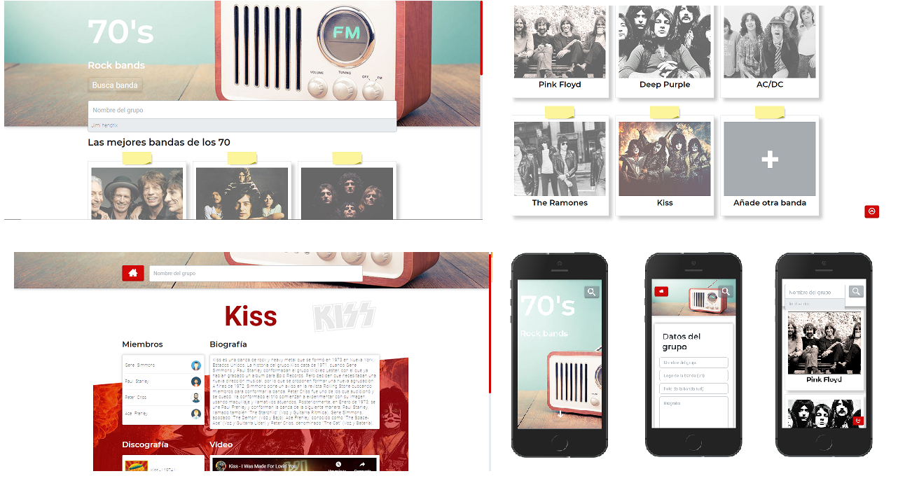

# Rock70

Aplicación para seguir y añadir tus bandas favoritas de los años 70.

## Development server

Ejecuta `ng serve` para levantar el proyecto (JsonServer incluido). Empieza a navegar en `http://localhost:4200/`. Podrás añadir, eliminar y visualizar un información de las bandas.

## Detalles de las pantallas

 
